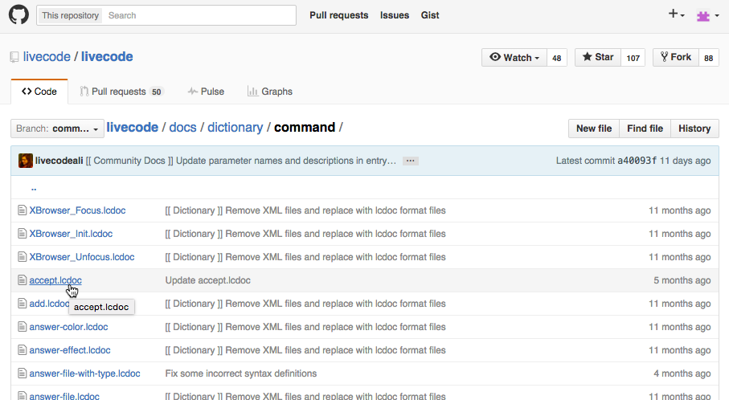
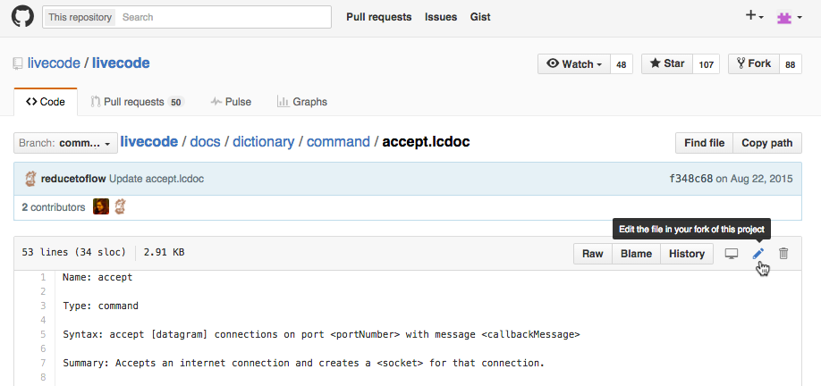
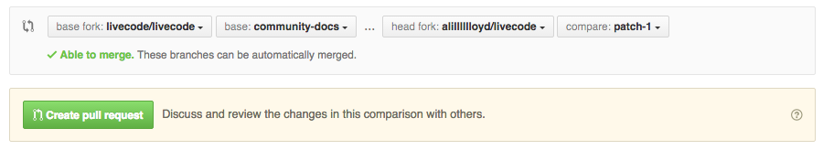

# Contributing to LiveCode Documentation

*Note this document is specifically about contributing to the 
documentation of LiveCode. If you are looking for a general guide to 
contributing to the LiveCode source, see the 
[toplevel CONTRIBUTING.md document](../CONTRIBUTING.md)*

Have you noticed an error in the documentation? Do you want to add an 
instructive example? Or can you explain a concept better than it is 
currently explained? Please consider submitting your proposed changes 
directly to the LiveCode repo on GitHub.

Please consult the [documentation style guide](development/docs_style_guide.md)
and the [documentation format specification](guides/LiveCode%20Documentation%20Format%20Reference.md)
for information on the standards and structure we aim to maintain in our
documentation.

# Documentation Objectives

Our objectives for the LiveCode documentation can be categorised as
- Completeness
- Correctness
- Instructiveness

## Completeness

In the context of the dictionary, completeness clearly entails the 
documentation of all LiveCode syntax. The most basic form of 
incompleteness is a completely missing dictionary entry. If you intend 
to write a missing dictionary entry, please bear these documentation 
objectives in mind and consult the 
[documentation format specification](guides/LiveCode%20Documentation%20Format%20Reference.md).

The dictionary ought to contain *all* the relevant information about a
particular piece of LiveCode syntax. Every syntax variant should be 
explained in detail in the description. Some of the most commonly 
missing information in our current dictionary is as follows:
- Inadequate or missing explanation of a parameter's function
- Omitted description of side effects, especially when `the result` or
`it` may be affected
- Omitted description of the function of optional syntax elements

## Correctness

Correctness of documentation comes in two forms.

Firstly, the information contained in the descriptions of elements 
should be accurate and up-to-date. Some of our documentation was written 
prior to major developments in both our software and the hardware it 
runs on.

Secondly, dictionary Syntax elements must be correct. The
[documentation format specification](guides/LiveCode%20Documentation%20Format%20Reference.md)
contains a description of the Syntax element.

Thirdly, the dictionary files must be formatted correctly. This means 
conforming to the aforementioned format reference, and also for 
parameters defined in the Syntax elements to correspond exactly to those
described later on in the entry.

Furthermore, where possible, individual lines within the document should
not exceed 72 characters in length. This makes it easier to read, and 
review on GitHub.

## Instructiveness

One major objective we have with our documentation is to improve our
code examples. Where possible, the `Example:` elements of the docs 
should be complete and runnable.
This means that where possible one of the following should apply:
-The example can be copied, pasted into the message box and executed to 
demonstrate the functionality being described.
-The example contains commented commands and functions which, can be 
copied and pasted into the script of an object, and which when called 
with appropriate parameters demonstrates the functionality being 
described.

In general, the way to ensure this is to use constants where possible, 
rather than variables and objects:

(Good)
`put sentence 1 of "Hello! Is it me you're looking for?"  -- output is 'Hello! '`

(Bad)
`put sentence tSentenceNum of field "fullText" into field "textSnippet"`

Encapsulate functionality rather than providing code snippets, and always
assume that strict compilation mode is on (i.e. always declare your variables)

(Good)

```
/*
Returns the number at 1-based index pIndex >= 2 in the Fibonacci sequence
*/
function fibonacciNumber pIndex
  local tFirst = 1, tSecond = 1
  local tCounter, tSum
  repeat with tCounter = 3 to pIndex
     put tFirst + tSecond into tSum
     put tSecond into tFirst
     put tSum into tSecond
  end repeat
  return tSecond
end fibonacciNumber
```

(Bad)
```
...
  put 1 into tFirst
  put 1 into tSecond
  repeat with tCounter = 3 to x
     put tFirst + tSecond into tSum
     put tSecond into tFirst
     put tSum into tSecond
  end repeat
...
```

## Tags

Tags are a great way to help users find what they want in the dictionary. 
However badly coordinated tags can quickly become a hindrance. Ensure 
the tag you want to add doesn't exist already in a slightly different 
form, and consider starting a dialogue about a new tag and what entries 
could be most usefully tagged with it.

## References

One thing to look out for when auditing a dictionary entry's references
is ambiguity of entry type. For example, there are two entries for URL:
one is for URL as a keyword, and one is a general description of the 
concept of a URL in the glossary. Sometimes two different references
should be used in the same sentence, for example:

	Use the <URL(keyword)> keyword to fetch the contents of a file 
	located at the given <URL(glossary)>
	
If there are many references in a given entry, consider sorting them
alphabetically - this helps prevent duplication and makes it easier to
spot potential ambiguities.

# Community Documentation Contribution Process

After creating an account on GitHub at https://github.com/join, there 
are three main ways of submitting pull requests. The first exclusively 
uses the GitHub website, and is most suitable for people with no 
experience of git or other version control systems.

## Using the GitHub Web Interface

It is possible to contribute to the LiveCode dictionary using the GitHub 
website, without having to download any software or use the command line.

### Making your dictionary change

**Navigate to the file you want to modify in the [dictionary folder of the develop-9.0 branch](https://github.com/livecode/livecode/blob/develop-9.0/docs/dictionary).**

For example, the accept command is at:
https://github.com/livecode/livecode/blob/develop-9.0/docs/dictionary/command/accept.lcdoc

Either go directly to the community docs branch URL
(https://github.com/livecode/livecode/tree/develop-9.0) or if you are 
on the main LiveCode repository page, select 'develop-9.0' from the 
branch dropdown menu:


You should see that the develop-9.0 branch is selected both in the 
label of the dropdown and the url of your browser.


Now use the file system browser to find the file you want to modify, and
click on it.



**Click the pencil icon to the right of Raw|Blame|History buttons**



Once you have clicked the pencil, you may get information that 
submitting a change will create a new branch in your fork of the target 
repo.


**Make your changes**

Please ensure that you have tabs enabled if you are indenting code 
blocks.


Also, try to ensure each line you modify is no more than 72 characters
long, adding return characters as necessary (the dictionary only breaks
paragraphs when there are two return characters in a row).

**In the Propose file change section, enter the title and description of your pull request.**


The title should be along the lines of 

`[[ Community Docs ]] <short description of what was fixed / updated>`

or if you are fixing a specific bug

`[[ Bug <bug number> ]] <short description of what was fixed / updated>`

For example:

`[[ Community Docs ]] Added working example to dictionary entry for accept command`

or

`[[ Community Docs ]] Ensure parameter names match those in syntax in dictionary entry for prepare command`

or

`[[ Bug 14970 ]] Correct tables in dictionary entry for HTMLText property`

The description field is only necessary if you have made any more major changes to a file.

For example your title might be

`[[ Community Docs ]] Rewrite various parts of dictionary entry for revXMLDeleteTree command`

and description

```
- Moved some information pertaining to *the result* into the result section
- Added details about how to use command to description
- Added working example illustrating how to use command
```

**Click the Propose File Change button.**

>*Note:* Please ensure the pull request has the correct base branch and 
comparison branch. The base fork should be `livecode/livecode`, with
base branch `develop-9.0`, and the head fork should be 
`<your user name>/livecode` with compare branch something like `patch-1`
(unless you have renamed it).



**Click Create Pull Request** 

It will confirm the title and description you entered before, and show 
you the files that are changed in the pull request.

Now is a good time to check the changes you are proposing.


**Click Create Pull Request again.**

You should now be able to see your pull request here
https://github.com/livecode/livecode/pulls, or by clicking the 'Pull
Requests' menu item at the top of the GitHub website.


**Sign the CLA if you haven't already**

Go to the list of pull requests and click on the link to your pull request.
If you have not signed the Contributor's Agreement, livecode-vulcan will have commented (or will soon!)
to ask you to:
1. Sign the LiveCode CLA
2. Link your GitHub account to the LiveCode account you signed with

Once you have done this, livecode-vulcan should remove the need-CLA tag from the pull request

If you are not fixing a specific bug in the bug database, then you're done! You can skip the next section.
Otherwise you need to add a release note describing what bug you have fixed.

### Adding a bug fix release note

**Click on the link to your github user name on the pull request (or go to `https://github.com/<user name>`)**

**Click on the link to your livecode repository (under the Popular Repositories heading).**

You should see a link to your recently pushed branch (called patch-1 or similar).

If you do, **click on the link to the recently pushed branch**. If not, select the branch 
from the branch dropdown list.

**Navigate using the folder listing to docs/notes**

At the top of the page you should see something like

Branch: patch-1   livecode/docs/notes/            New File | Find File | History

**Click on New File**

**Name the file**
It should be called:
`bugfix-<bug number>.md`

**In the file contents, put the single line**

`# <Description of bug fixed>`

Usually it suffices to copy the title of the bug in the bug report.

**In the Commit new file section, add**

`Add release note`

or something similar.

**Click the "Commit new file" button.**

Check the pull request again in https://github.com/livecode/livecode/pulls
You should see the "Add release note" commit added to the pull request.

**Post a link to the pull request on the bug report.**

### Await review

Once all the above has been sorted out, someone will review your pull request. Please 
check back in case there is something that the reviewer would like you to change.

When the pull request has been reviewed, it will be merged into the main repository and 
should be in the LiveCode Dictionary in the next release!

## Making further changes

If you need to make further changes to your pull request, first make 
sure you are looking at the pull request you want to change (you can 
find your pull request either in the list of pull requests to the 
livecode repo at https://github.com/livecode/livecode/pulls, or by 
clicking the 'Pull Requests' menu item at the top of the GitHub website 
which shows all your outstanding pull requests).

**Click on the 'Files Changed' tab**


**Click on the pencil again to make further changes**


**Commit your changes to the same branch**


The pull request will be automatically updated.

## Using Git GUI software

Download a Git GUI Client from 
http://git-scm.com/downloads/guis

Once you have familiarised yourself with the client, go to the livecode repo
https://github.com/livecode/livecode
and click Fork, and then "Clone in Desktop" button at the top right.
clone to a suitable location.

Click the branch button
name it something suitable

Modify what you want to change

You should see the change appear in the GUI client.

If you are fixing a particular bug in the bug database, you need to add a release note 
describing what bug you have fixed.

Add a new file to docs/notes locally, named `bugfix-<bug number>.md`, containing the single line

`# <Description of bug fixed>`

Make sure both the docs change and the bugfix note are ready for commit in the GUI client.

In the summary and description section,

The title should be along the lines of 

`[[ Community Docs ]] <short description of what was fixed / updated>`

for example:

`[[ Community Docs ]] Added working example to dictionary entry for accept command`

or

`[[ Community Docs ]] Ensure parameter names match those in syntax in dictionary entry for prepare command`


The description field is only necessary if you have made any more major changes to a file.

For example your title might be

`[[ Community Docs ]] Rewrite various parts of dictionary entry for revXMLDeleteTree command`

and description

`
- Moved some information pertaining to *the result* into the result section
- Added details about how to use command to description
- Added working example illustrating how to use command
`

Click commit to <branch>

Then click "Submit pull request"

Make sure the target branch is livecode/develop-9.0

Check the pull request has appeared in
https://github.com/livecode/livecode/pulls

## Command Line

go to the livecode repo
https://github.com/livecode/livecode
and click Fork

then in a terminal window, in a suitable directory, run

`git clone --recursive https://github.com/<your user name>/livecode.git`

once this is done, change directory into the newly created directory

`cd livecode`

and add the livecode repo as upstream

`git remote add upstream https://github.com/livecode/livecode.git`

make sure your name and email address are set up

`git config --global user.name "<your name>"`

`git config --global user.email "<your email address>"`

checkout the `develop-9.0` branch

`git checkout develop-9.0`

ensure it is up to date

`git pull upstream develop-9.0`

create a new branch for your docs changes, for example

`git checkout -b docs-accept_command`

make your changes to the file you are changing, then add the changes to the staging area

`git add docs/dictionary/command/accept.lcdoc`

If you are fixing a particular bug in the bug database, you need to add a release note 
describing what bug you have fixed.

Add a new file to docs/notes locally, named `bugfix-<bug number>.md`, containing the single line

`# <Description of bug fixed>`

and add that to the staging area too

`git add docs/notes/bugfix-10000.md`

Then commit your changes

`git commit -m "[[ Community Docs ]] <short description of what was fixed / updated>"`

for example:

`git commit -m "[[ Community Docs ]] Added working example to dictionary entry for accept command"`

Push the changes to your fork of the repo

`git push`

Navigate to your fork on the Git website, `https://github.com/<your user name>/livecode/`

You should see a link to the recently pushed branch, and an invitation to submit a pull request.
Click this. 

Ensure the base fork is livecode/livecode, and the base is develop-9.0.

Click create pull request.

Check the pull request has appeared in
https://github.com/livecode/livecode/pulls
