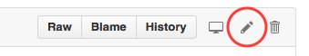

## A Handy Checklist for Editing Entries in the LiveCode Dictionary (API)
Ali has provided some great documentation for editing LiveCode dictionary entries. This checklist presumes that:

* You've read [Ali's blog post](https://livecode.com/putting-the-you-in-documentation/ "Putting the YOU in Documentation"), "Putting the YOU in Documentation".

* You've perused the [Contributing to LiveCode Documentation](https://github.com/livecode/livecode/blob/community-docs/docs/contributing_to_docs.md) guide, so you have a general idea of what to do and how to do it. The section on [Learning the Basics of Github](https://github.com/livecode/livecode/blob/community-docs/docs/contributing_to_docs.md#using-the-github-web-interface) is especially important.

* You've reviewed the [LiveCode Documentation Format Reference](https://github.com/livecode/livecode/blob/community-docs/docs/guides/LiveCode%20Documentation%20Format%20Reference.md), so you are basically familiar with the format of a dictionary entry.

If you're like me, by this point your head is swimming with all the information you have to remember. Still, I decided to jump right in and give it a shot. Along the way I made some blunders, but thanks to the patient guidance of Ali, Peter, and some other community members I have gotten the hang of it. Since there are a lot of details to remember, and since I'm a checklist kind of guy, I created this checklist-style guide for myself to refer to as I review a dictionary entry. Much of this information is taken from the documents referred to above, and much is taken from my own experience making changes and interacting with the LiveCode team.

>*Note:* This checklist assumes you are using the [GitHub web interface](https://github.com). It is assumed that if you are familiar with another Git interface you will be able to transfer these instructions to that interface. 

### [ ] Find a dictionary entry you think needs improving

There are several ways of doing this. Let me suggest a few here:

* Check the [list of Documentation bugs in LiveCode's bug tracker](http://quality.livecode.com/buglist.cgi?resolution=---&query_format=advanced&token=1452855087-20cfd8992ae1a7b6dc3560a4a0aad511&bug_status=CONFIRMED&component=Documentation&list_id=55772). Fixing these bugs not only improves the documentation, but also makes the reporter of the bug happy. *If you fix one of these, don't forget to add a bug fix release note!*
* Go back to the dictionary in LiveCode 7 or older and look for entries with User Notes added to them. These notes may be good candidates for adding to the dictionary.
* The next time you read a dictionary entry and something seems unclear, think about how you could improve it.
* Just start at the beginning of the dictionary and start reading entries. It doesn't take long to start seeing omissions or errors that you can fix. In fact, just reading this checklist should give you ideas of things that can be improved in most dictionary entries. In particular the code examples of many entries needs improving based on the standards outlined in [Contributing to LiveCode Documentation](https://github.com/livecode/livecode/blob/community-docs/docs/contributing_to_docs.md).

### [ ] Find and fork the appropriate document [*from the correct branch*](https://github.com/livecode/livecode/blob/community-docs/docs/contributing_to_docs.md#making-your-dictionary-change) on Github

This is very important. Note that this has changed from when Ali first posted his instructions on how to edit dictionary docs. You should now always start at <https://github.com/livecode/livecode/tree/develop/docs/dictionary>. From there drill down into the category and specific entry you want to edit. For example, if I want to change something in the documentation for the absolute value function `abs()`, click on **function** then **abs.lcdoc**.

### [ ] Edit the document by clicking the pencil icon to the right of the Raw | Blame | History buttons.

Once the document is open for editing you can begin to make changes. You probably will have a specific correction to make, and you could just find it, change it, and be done. In addition I have found it useful, "while I'm in here anyway" to methodically check the following in each document I edit.

#### [ ] Ensure all required elements are included:
>*Note:* If you are editing an existing document, these elements should already be included. Just scan and make sure they are present and that they have no obvious errors.

* Name
  - Name of the language entry. Must be a single word.
* Type
  - In Dictionary (API) entries this will be one of the following:
      * command
      * function 
      * property 
      * message 
      * constant 
      * keyword 
      * control structure 
      * operator 
      * statement 
      * expression
* Syntax 
  - Check for formatting errors and conflicts between parameter names and LiveCode reserved words.
* Summary
  - Single line only. More in-depth goes into the Description element.
* Description	
  - This is the full, detailed description of the entry.
  - You may use [markdown](https://github.com/adam-p/markdown-here/wiki/Markdown-Cheatsheet) elements in this section.
  - Much of the work to be done in improving API entries will be in this section.

#### [ ] Ensure optional elements are included as appropriate
*	Synonyms (if there are any)
	- Check for obvious omissions. For example, synonyms for the `return` entry should be `cr,linefeed,lf`.
*	Associated (One of *object type*, glossary, *library designation*, or widget)
  - Check for missing associations, i.e., language elements that only apply to certain object types or are only available in certain libraries. These are most commonly seen for property and message entries. For example:
     + the `duration` property should have an association of `player`
     + the `linkClicked` message should have an association of `field`
     + the `angle` property should have associations of `graphic,image`
*	Introduced 
  - In an existing entry this should be there already; make sure it looks like a valid LiveCode version number; e.g. 1.0 or 5.5.
*	OS (Check to make sure this list seems accurate.)
*	Platforms (Check to make sure this list seems accurate.)
*	Examples
	- There may be any number of Example elements. It never hurts to add an example or two if you think it will help to better illustrate the usage of a language term.
	- Examples should conform to [new guidelines for Instructiveness](https://github.com/livecode/livecode/blob/community-docs/docs/contributing_to_docs.md#instructiveness).
	- Important things to check in examples:
	   + Make sure the example could be pasted into the message box or an object script and "just work".
	   + Always assume strict compilation mode is on, thus all variables should be declared.

* Parameters 
 - All parameter names shown in the Syntax element should be listed and explained in the Parameters element in the format parameter name(type): Description. For example:

      >prompt(string):A text string instructing the user what to do.

	- Use of parameter names in other elements, such as Description, should be enclosed in &lt;angle brackets&gt;.
  
	- Look for conflicts between parameter names and referenced/linked vocabulary; e.g. if a Syntax element uses *property* as a parameter name, it may be best to change it to something like *propertyName*.
	
* Value or Returns
  - These two elements are mutually exclusive; only one should appear in any document.
  - Use a Returns element for the return value of a function; e.g.:
  
      >Returns: The abs function returns a positive number.
    
  - Use a Value element when a value is both an input and output value, as for the value of a property; e.g.:
  
      >Value(bool): The visible of an object is true or false.
    
  - Some commands and functions change the value of `it` and `the result`. In these cases use the special elements **It** and **The result**. For example the entry for the `answer` command should contain this element:
  
      >It: The name of the button the user chooses is placed in the it variable.

* Changes
  - If you know that there have been changes to the way a LiveCode term has behaved, make sure those changes are noted here.
  
* References
  - Make sure there are no duplicate entries. One simple way to do this is to copy the list into a text processor and sort it alphabetically. Duplicate entries would obviously show up next to each other.
  - Another reason to sort long lists of References alphabetically: References are rendered as categorized lists in the Related field of the LiveCode dictionary entry. Alphabetized lists in the categories may be easier to peruse than randomly presented lists. 
  - Make sure all entries are appropriate to the term being described.
  - Make sure that each linked term in Description and Parameters is included in the References list.
  
* Tags
  - Tags are used in the LiveCode dictionary to filter entries. See the dictionary in LiveCode for a list of currently used tags.
  - Is the tag listed appropriate to the term?
  - Is a tag missing that should be present? Exercise caution in adding tags, since if the list of tags used becomes too long it can reduce the usefulness of tags.
	  

### General Things to Check and Fix (Mainly in Parameter and Description elements)

#### [ ] Review  links and references:
  - Scan for vocabulary that should be linked but isn't.
  - Make sure linked vocabulary items have a corresponding entry in the References element.
  - Determine whether the term listed in References is appropriate; e.g., field (keyword) vs. field (glossary). Often the former is listed in References when the latter is more appropriate;
  - Check for "overloaded" entries in References; e.g. field (object), field (keyword), field (glossary). If this condition exists for any vocabulary term, make sure that embedded links in the other elements reflect the proper entry; e.g. &lt;field(object)&gt;, etc.
  >*Note:* Since Markdown also attempts to render HTML tags, Reference entries that happen to match an HTML tag should be disambiguated, even if there is only one entry for that term in References. For example,
  if you link the term "object", do it like this: &lt;object(glossary)&gt;
  
  - Look for variations on linked language terms and use alternate form notation in the links; e.g. "of a &lt;field|field's&gt; background color...".

#### [ ] Proofread the text in the various elements
  - Read through element sections and correct confusing wording, misspelled words, grammatical errors, etc.

#### [ ] Dictionary Style Conventions:
  - Notes indented (blockquoted) and the word *Note* italicized:

  >&gt;&#42;Note:&#42; Yada yada.
  
  - Code blocks (outside of the Example element) should be properly formatted by inserting 4 leading spaces before each line.
  - Inline code references designated by \`back ticks\`.
  - Are &#42;&#42;bold&#42;&#42; and &#42;italic&#42; tagging used appropriately, but not over-used?
  
#### [ ] Hard wrap lines to 72 characters for easier reading in the Github interface.
	
### [ ] Submit the changes
This is covered thoroughly in [Contributing to LiveCode Documentation](https://github.com/livecode/livecode/blob/community-docs/docs/contributing_to_docs.md). As a reminder here is a summary of the steps for submitting your changes.

Directly beneath the editing section there is a **Propose file change** section.
 
  - Name the change appropriately. Normally something like this:
  
  > [[ Community Docs ]] entryName various fixes
  - If more than one change has been made, summarize the changes made in the content area beneath the title.

  - Click **Create Pull Request**.
  - Click **Create Pull Request** again.
  
  - [Add bug fix release note](https://github.com/livecode/livecode/blob/community-docs/docs/contributing_to_docs.md#user-content-adding-a-bug-fix-release-note) if needed.
