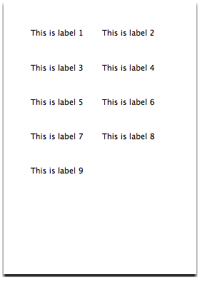
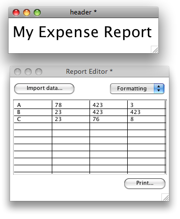

# Printing In LiveCode

## Introduction

Printing is a vital aspect of many applications. LiveCode provides a
comprehensive set of printing capabilities. Whether you want a simple
print out of your stack, want to print labels or produce complex
reports, LiveCode has the features you need.

LiveCode supports a number of methods of printing. You can use the
*print card command* and have LiveCode manage the layout of cards on the
paper. Alternatively you can use the *print into rectangle commands*
which allow you to take full control over the layout of your print out.
The former method is most suited to implementing simple print
functionality, while the latter is better suited for more complex layout
printing or printing reports. Finally, you can use the built-in field
printing script library to print the contents of any text field using a
simple command.

LiveCode also includes a full set of features to access and set printer
device options, including options such as margins, page range and number
of copies. This feature is invaluable if you want to produce a high
resolution PDF file from your stack.

## Controlling Printer Device Settings

LiveCode gives you full programmatic control over your printer device
and any available settings.

### Choosing a Printer

Use the **availablePrinters** to list the printers available on the
user's system. Printers can include fax modems and networked devices. If
the **availablePrinters** is empty, no printer is assigned. For example,
to place a list of the available printers into a list field:

	put the availablePrinters into field "list of printers"

Set the **printerName** to the printer you want to use to print. You can
use any printer listed in the availablePrinters. This property is useful
when producing an in-house utility that needs to print to a specific
printer on the corporate network, or for automatically restoring the
user's previous printer choice stored in a preferences file.

	set the printerName to the cSavedPrinter of stack "My Preferences"

The **printerFeatures** provides a list of the features supported by the
currently selected printer. Features will vary widely from device to
device, but typical features may include things such as "collate",
"color" and "duplex". Use this property to enable and disable output
options in any custom printer settings dialog.

### Choosing Output Mode (e.g. Print to File)

The **printerOutput** global property allows you to choose the output
mode for subsequent printing commands. This property is set by the
system to the default printer on startup and will be changed if you open
a system print dialog in which the user chooses a different printer. If
this property is set to *device* it will output to the physical printer.
Alternatively, you can set it to a file path to print to a file. On Mac
you can set this to *preview* to create a preview.

For example, to save the current card to a file:

	ask file "Save as:
	set the printerOutput to ("file:" & it )
	print this card

### Working with Printer Dialogs

In most applications that need to print, you will want to provide a way
to bring up the standard OS Print and Page Setup dialogs. Typically you
would make these dialogs available from Print and Page Setup items in
the File menu of your application. When the user makes changes in these
dialogs the changes are made accessible to you in global properties. We
discuss how to save and utilize these properties below.

> **Note:** It is not necessary to bring up the standard OS dialogs to
> alter printer settings. You may set the appropriate printer setting
> directly by script instead.

On Linux systems you will need a recent version of GTK installed in
order to display the OS printer dialog. If you don't have this
installed, LiveCode will display its own printer dialog which has been
built as a stack and script library. This dialog mimics the standard
system printer dialog and sets the LiveCode printing global properties
directly.

> **Tip:** You may force LiveCode to use its own internal print settings
> dialog by setting the `systemPrintSelector`global property to false.
> Advanced users may customize the printer dialog that LiveCode uses by
> running `toplevel "print dialog"`or `toplevel "page setup"`in the
> Message Box. Remember to save a copy of the stack as it will be
> overwritten each time you upgrade your copy of LiveCode.

> **Important:** The LiveCode print and page setup dialogs must be
> included in a standalone application if you use them. Ensure that the
> check box Print Dialog is turned on in the Standalone Application
> Settings dialog for your application. You do not need to include these
> dialogs if you only use the OS native print dialogs. For more
> information on including resources in your standalone application, see
> the chapter on Building Standalone Applications.

To bring up the standard OS printer dialog, use the **`answer printer`**
command.

	answer printer

If the user does not press the cancel button then any changes to the
printer settings will be reflected in the global printing properties,
discussed below.

To bring up the standard OS page setup dialog, use the 
**answer page setup** command.

	answer page setup

### Saving Printer Settings

To save or set a complete set of options relating to the current printer
which includes every setting in the OS Page Setup and Print dialogs, use
the **printerSettings** global property.

The **printerSettings** property is a binary string that completely
describes the current settings. The property contains the name of the
printer and the settings currently in use.

You should not attempt to modify the printerSettings but rather get and
set it in its entirety. To access individual printer properties, use the
global printing properties described below.

When you set the **printerSettings** property to a saved value, LiveCode
will choose the printer named in the property and set all of its
settings to those contained within the property. If the printer cannot
be found LiveCode will return the error "unknown printer" in the result.
If the printer is found but the settings are not valid then LiveCode
will choose the printer and reset it to default values.

> **Note:** You must save a separate copy of the printerSettings
> property for each printer 
>or OS you intend to use. The printerSettings property cannot be
>transferred between platforms. For example, a printerSettings property
>generated on a Windows computer cannot be used on Mac – even for the
>same printer. If you want to alter settings across different platforms
>and printer types use the global printing properties described below.
>Use the printerSettings for convenience when you know you will be using
>the same printer and want to save all the settings, or where you are
>setting esoteric properties not listed in the global printing
>properties described below.

To save the current printer settings into a custom property stored on
the current stack:

	set the cSavedPrinterSettings of this stack to the printerSettings
	save this stack

Then to restore these settings:

	set the printerSettings to the cSavedPrinterSettings of this stack

## Paper Related Options

This section discusses how you get and set paper related options – the
rectangle area of the paper, the paper size, the orientation and the
scale to use to print onto the paper. These paper options apply to all
types of printing, i.e. card, field and layout printing.

Use the **printRectangle** to get the printable rectangle area within
the paper (returned in device co-ordinates). This property takes into
account any settings applied by the user in the Page Setup and Printer
dialogs including the print orientation (e.g. landscape or portrait).
The rectangle is represented left,top,right,bottom and is always
relative to the top left of the page – thus the top left will always be
0,0. The printRectangle will always be within the
**printPaperRectangle** – the rectangular area of the sheet of paper.

The printRectangle property is read only and cannot be set directly – to
alter it you must set other options relating to the paper, for example
the **printPaperOrientation**(discussed below).

Do not confuse the **printMargins**and other card layout printing
properties with paper properties such as the **printRectangle**. The
**printMargins**only applies to printing cards using LiveCode's automatic
card layout capabilities (discussed below). Thus the **printMargins**has
no effect on **printRectangle**.

Use the **printPaperOrientation** to get and set the orientation of your
print out. This property may be set to one of the following values:

*portrait*: rotated 0 degrees.

*landscape*: rotated 90 degrees clockwise.

*reverse portrait*: rotated 180 degrees clockwise.

*reverse landscape*: 270 degrees clockwise.

	set the printPaperOrientation to "landscape"

Use the **printPaperScale** property to apply a scale factor to your
print out after all other settings have been taking into account.

The **printPaperScale** is applied after all other layout and scaling
options. For example, if you have used the layout printing features to
print a series of cards at 50% scale, then set the **printPaperScale**,
this factor will be applied to the entire layout after the card layout
scaling has been calculated.

To print a range between 1 and 100% set the **printPaperScale** to a
number between 0 and 1. To print at 200% set the **printPaperScale** to
2.

	set the printPaperScale to 0.5 -- 50%

## Job Related Options

This section discusses how to get and set job related options – the
number of copies, duplex printing, collation, color, title and printable
area.

> **Important:** The available job options all depend on what the
> currently selected printer supports (use the
> **printerFeatures**property, described above, to retrieve a list of
> features supported by the current printer).

Use the **printCopies** property to get and set the number of copies to
print. The printCopies should be set to a value of 1 or more.

	set the printCopies to 5 -- print 5 copies

Use the **printDuplex** property to tell the printer to print double
sided. This property may be set to any of the following values:

- *none*: no double-sided printing 
- *short edge*: double-sided printing with tumble (flip the non-facing 
page) 
- *long edge*: double-sided printing without tumble.

	set the printDuplex to "short edge"

Use the **printCollate** property to specify whether to interleave
multiple copies of a print job. If a print job has three pages, P1, P2
and P3, with printCollate set to *true* and **printCopies**set to 2 the
output order will be P1, P2, P3, P1, P2, P3. With printCollate set to
*false* the output will be P1, P1, P2, P2, P3, P3.

	set the printCollate to true

Use the **printColors** property to specify whether to print in color or
not. If "color" is not among the lines of the **printerFeatures** then
this property will have no effect and all print jobs will be printed in
monochrome. This property may be set to either *true* or *false*.

For example, to check if color printing is supported on the current
printer and use it if it is:

	if "color" is among the lines of the printerFeatures then 
		set the printColors to true
	end if

Use the **printTitle** property to specify the name of the next print
job in the system printer queue. Setting this property to match the name
of the user's document will ensure that the user is able to recognize it
in the system printer queue utility. If the **printTitle**is empty at
the start of a printing loop, the title of the defaultStack will be used.

	set the printTitle to "My Report 1"

Use the **printRectangle** property to determine the printable region of
the physical page as returned by the printer. This rectangle will always
be contained within the **printPaperRectangle**. Thus you should use the
printRectangle and not the **printPaperRectangle** when calculating a
print layout. The **printPaperRectangle** is useful if you are
generating a print preview and want to show the entire area of the paper
including any margin areas that cannot be printed on. This property is
read only and cannot be set directly.

### Printer Font Metrics (Windows)

Windows systems sometimes use different versions of the same font for
displaying text on screen and printing. This can result in layouts and
line breaks differing between the screen display and the printed output.
To prevent this from happening, you can tell LiveCode to use the printer
fonts for display on screen. To do this, set a stacks
**formatForPrinting** property to true.

**Do:**                                                                                                                                                                                                                                
- Set the **formatForPrinting**stack property to true before loading a 
stack in memory. If the stack is already loaded, set this property to 
true then save and reload it. (Save then use 
*Close and Remove from Memory* in the File menu).  
- Create a stack off screen (with **formatForPrinting** set to true) 
with your print layout template and copy text into it prior to printing.                                                                                                 
- Set the **formatForPrinting**before doing any print layout related 
calculations on the stack.                                                                                                                                              
- Set the **formatForPrinting**to true on any print preview stack being 
displayed to the user.

**Don't:** 
- Allow the user to directly edit text in fields whose 
**formatForPrinting** is set to true. Attempting to do this may cause 
display anomalies. Set this property to false and reload the stack 
first.                 
- Generally use stacks with **formatForPrinting**set to true for display 
on screen, as this will show text that has been optimized for print 
display (instead of screen display), which is harder to read on screen.  
- Use this property on other platforms – Windows is the only platform 
that uses different fonts on screen vs. in a print out.                                                                                      
- Use the **windowBoundingRect** property to constrain display of a 
stack who's **formatForPrinting**has been set to true – this property 
will be ignored when the stack is opened or maximized.

## Printing a Card

Once you have set your printer, paper and job options (above) you are
now ready to use one of the print commands to start printing. At its
simplest, the **print** card command allows you to print a card. Later
we will discuss ways of printing more complex layouts, fields and text.

	print this card -- prints the current card
	print card 12 -- prints card 12

For more details on how to specify which cards to print, see the 
**print** command in the *LiveCode Dictionary*.

To print a scale between 1 and 100% set the **printScale** to a number
between 0 and 1. To print at 200% set the **printScale** to 2.

The printScale applies to each card that you print. It is not related to
the **printPaperScale** which is applied to the entire print job after
all other scaling calculations have been applied. Thus you may set the
**printPaperScale** to 0.5 to print at 50%, then print individual cards
at different printScale values. With a **printPaperScale** of 0.5, a
printScale of 2 would result in that card being printed at 100%.

When printing a card, use the **printMargins** to specify the margins
around the border of the card on the page.

> **Note:** When calculating placement on the printed page, all
> calculations assume that there are 72 dots per inch – regardless of
> platform or printer device. LiveCode will automatically adjust the
> print out for resolution of the actual device. This makes it simple to
> calculate your printed layout.

	-- a one-inch margin on each side
	set the printMargins is set to 72,72,72,72

The **printMargins** only applies when using print card directly. It
does not have any effect on printing cards into a layout (described
below).

The **printCardBorders** property specifies whether or not the bevel
border around the edge of a card should appear in the print out.

### Card Layout Options

When using the basic print card form of the print command, there are two
layout options that allow you to customize the positioning of cards on
the printed page. If you require further flexibility, see the section on
printing a layout, below.

Use the **printRowsFirst** property to specify whether cards should be
printed across and down or down then across.

Consider a simple example of printing multiple cards – this example is
useful for printing labels. In this example we have a stack that
contains 8 cards, each one containing a mailing label. If you want to
try out this example:

- Create a stack and size it to be small – the size of a mailing label
- Create a single field, and in the field Inspector turn off the 
*Shared Text* property
- Group the field and in the group property *Inspector* turn on 
*Behave as Background*
- Turn on *Select Grouped* on the Toolbar and select the field
- Place the contents of the first mailing label into the *Contents* tab 
of the *Inspector*
- Create 8 more cards, and in each select the field and place the 
contents of a different label

Thus we have a stack that looks like the figure below.

Now we will implement the printing commands. If this was a real
application you would probably want to put these in a Print command in
the File menu. In this instance you may execute the following in the
multi-line message box (open the Message Box then press the second icon
to get the multi-line pane).

	-- allow the user to choose printer output options
	answer printer
	print 9 cards

Press enter to execute the commands.

The resulting print out will look like the figure below.

If we modify the print commands to include an additional line to turn
off the printRowsFirst:

	answer printer
	set the printRowsFirst to false
	print 9 cards

The resulting print out will look like the figure below.

Use the **printGutters** property to specify the margin between each
card. By default the printGutters are set to 36,36 or one half inch
horizontally and vertically.

In the following example, we print the same label stack but reduce the
space between each label to 1/10th of an inch. To make it
easy to see the differente we also turn on printing of card borders
using the printCardBorders property.

	answer printer
	set the printGutters to 7,7
	set the printCardBorders to true
	print 9 cards

The resulting print out will look like the figure below.

## Printing Fields & Text

To print a field, use the **revPrintField** command. This command takes
a single parameter, a reference to a field. This command only allows
printing a single field. If you need to include a header and footer or
text you have constructed programmatically, see the **revPrintText**
command below.

	revPrintField the long id of field "text document"

**revPrintField** is implemented as a script library located in the
LiveCode IDE. The script library creates an invisible stack, sets the
rectangle of that stack to the current paper size, sets the
**formatForPrinting**to true, creates a field, then copies the contents
of the field you specify into this invisible stack. It then prints the
field one page at a time, scrolling the text after each page. Advanced
users can locate this library script by going to the *Back Scripts* tab
in the Message Box, turning on the checkbox for *Show LiveCode UI Back
Scripts*, then editing the script of *stack "revPrintLibrary"*. The
*revPrintField* handler is near the top of the script.

Use the **revShowPrintDialog** command to control whether the system
printer and page setups dialogs should be shown by **revPrintField** or
**revPrintText**.

	-- show the system printer dialog, but not page setup
	revShowPrintDialog true, false
	revPrintField the long id of field "text document"

Use the **revPrintText** command to print plain or styled text together
with an optional header and footer.

	revPrintText textToPrint [,headerText [,footerText [,fieldTemplate]]]

The *textToPrint* is anything which evaluates to a string. If you want
to printed styled text, pass HTML instead of plain text. (To convert a
field containing styled text to a HTML use the **htmlText** property.)

The *headerText* and *footerText* contains the text to use as a header
and footer. You may include an expression that is computed for each
page. For more details on using expressions, see the 
*LiveCode Dictionary* entry for **revPrintText**.

The *fieldTemplate* parameter allows you to specify a field reference to
use. Fonts in the print out will be inherited from this field.

## Printing a Layout

If you need to print a more complex layout than allowed with the basic
print card command or text printing commands (described above), you can
use the **print card into rect** syntax to create any sort of layout you
choose.

	print card from topLeft to rightBottom into pageRect

The *topLeft* is the top left coordinate of the current card to start
printing at.

The *rightBottom* is the bottom right coordinate of the current card to
stop printing at.

The *pageRect* is therectangular area on the paper to print into.

printMargins only applies when using print card directly. It does not
have any effect on printing cards into a layout. Use the
**printRectangle** to get the printable area when working with layout
printing.

For example, lets say that we want to print the text field from the
middle of the stack in the figure below. (You can load the stack shown in
the picture by going to your LiveCode installation folder then opening
Resources-\> Examples-\> SQLite Sampler.rev.) We want the output to
scale to take up the entire width of the paper and half the height.

	local tRect
	put 0,0,item 3 of the printRectangle, \
		round(item 4 of the printRectangle / 2) into tRect
	print this card from the topleft of field "theText" \
		to the bottomRight of field "theText" \
		into tRect

This results in the print out shown in the figure below.

You can construct a complex layout taking components from multiple
stacks by printing a sequence of rectangles onto the same page. For
example, you may have a stack that contains a standard header and
footer, another that contains a logo, and a layout that contains text.
Use the **open printing** command to start a print job, then print each
element into the appropriate rectangle on the paper. The use then
**close printing** command to send the print job to the printer. The
example in the figure below shows two stacks with printable regions that
we want to combine onto a single sheet of paper.

To print these onto a single sheet:

	answer printer -- show the system print settings dialog
	open printing -- start a print job
	-- work with the header stack
	set the defaultStack to "header"
	-- print the header field onto the top left of the paper
	print this card from the topLeft of field "header" \
		to the bottomRight of field "header" \
		into the rect of field "header"
	-- save the bottom of the header
	put the bottom of field "header" into tHeaderBottom
	set the defaultStack to "report editor"
	-- print the table field below the header
	print this card from the `topLeft`of field "report table" \
		to the bottomRight of field "report table" \
		into 0,tHeaderBottom,the`right of field "report table", \
		the bottom of field "report table" + tHeaderBottom
	-- send `the`job to `the`printer
	close`printing

### Printing a complex layout

To print a more complicated layout, create a stack and set its rectangle
to the current **printRectangle**. Add rectangular areas for each
component you will be printing. Then set *Geometry* properties (see the
section on the *Geometry Manager*, in the **LiveCode Script** guide for
more information) on each of these rectangles so they resize correctly
when the stack is scaled. Set up your print routine so that you open
this stack invisibly then resize it to the **printRectangle**. This will
trigger the geometry routines and scale the rectangular areas correctly.
Then run your sequence of print commands to print into each rectangle.

In the figure below, we have set the size of the stack to the
**printRectangle** then added 4 rectangle graphics. We have named each
graphic and turned on the *Show Name* property for each so you can see
the name.

Next, we set Geometry properties for each of the rectangle graphics. The
header graphic is set to scale relative to the right and bottom, with a
minimum size limit of 100 pixels (see the figure below). The body graphic
is set to link the top edge to the header graphic, the right and bottom
to the stack (see the figure below). The footer 1 graphic is set to scale
the right edge and position the bottom edge. And footer 2 is set to
position both the right and bottom.

To make the printing template stack take on the size of the paper, we
can add the following handler to the stack script:

	on preOpenStack
		set the width of this stack to (item 3 of the printRectangle - item 1 of the printRectangle)
		set the height of this stack to (item 4 of the printRectangle - item 2 of the printRectangle)
	end preOpenStack

We now have a working print template stack. All that remains is to write the script that 
prints into the rectangles:

	-- prepare to load this stack off screen
	hide stack "print layout"

	-- this will trigger the stack to resize, which run the geometry 
	-- routines, giving us the correct values for each rectangle
	go stack "print layout"

	-- now we store these rectangle coordinates in variables
	put the rect of graphic "header" into tHeaderRect
	put the rect of graphic "body" into tBodyRect
	put the rect of graphic "footer 1" into tFooter1Rect
	put the rect of graphic "footer 2" into tFooter2Rect

	-- we can close the layout stack as its no longer needed
	close stack "print layout"

	-- load the system printer dialog to allow the user 
	-- to choose number of copies, etc.
	answer printer

	-- start the print job
	open printing

	-- set the stack we are working on to a stack containing the header
	-- you could use any stack or region within a card here
	set the defaultStack to stack "header graphics"

	-- print from the rectangle of our header group 
	-- into the rectangle we stored earlier
	-- we could use a graphic or any rectangular area instead of a group
	print this card from the topLeft of group "header" \
		to the bottomRight of group "header" into tHeaderRect

	set the defaultStack to "body contents"

	print this card from the topLeft `of`group "body" \
		to the bottomRight of group "body" into tBodyRect

	set the defaultStack to "footer1"

	print this card from the topLeft of group "footer1" \
		to the bottomRight of group "footer1" into tFooter1Rect

	set the defaultStack to "footer2"

	print this card from the topLeft of group "footer2" \
		to the bottomRight of group "footer2"

	-- send the print job to the printer
	close printing

	-- check to see if the user cancelled or there was an error
	if the result is “cancel” then
		-- insert any code you need here to handle cancellation
	else if the result is not empty then
		-- bring up an error dialog
		answer “Printer Error”
	else
		-- insert any code you need here to handle success
	end if

For more information on how to print multiple pages of a complex layout,
see the section on *Printing Multiple Pages*, below. For information on
printing scrolling text fields into an area within a layout, see the
section on *Working with Scrolling Fields when Layout Printing*, below.

## Printing Multiple Pages

### Multiple pages using card printing

To print multiple pages when printing cards, simply specify which cards
you want to print as part of the print command.

	print {range}

Examples:

	-- prints the current card
	print this card
	-- prints all cards in the current stack
	print all cards
	-- prints the next 10 cards, starting with the current card
	print 10 cards
	-- prints card 3 to 7 of the current stack
	print card 3 to 7 print marked cards
	-- prints all cards where the mark property is true
	print marked cards

### Multiple pages when using layout printing

To print multiple pages when printing layouts, use the **open printing**
command to open a print job. Then print the layout for the first page
(see above). Then use the **print break** command to insert a page break
into the print job. Then lay out the second page and so on. Finally, use
the **close printing** command to send the print job to the printer.

### Working with Scrolling Fields when Layout Printing

To print a single scrolling text field, use the **revPrintText** command
(see above for more information). If you want to incorporate the
contents of a scrolling field within a layout, use the **pageHeights**
property to scroll the field each time you print a page, then **print
break** to move to the next page.

The pageHeights returns a list of values to indicate how far a scrolling
field needs to be scrolled to avoid clipping a line of text on each page
of your print out. (You should use this feature in conjunction with the
formatForPrinting property, above.)

	-- store a list of pageHeights
	put the pageHeights of field "body text" into tHeightsList
	-- scroll the field to the start
	set the scroll of field “body text” to 0
	-- start the print job
	open printing
	repeat for each line l in tHeightsList
	-- clip the field to the bottom of the last visible line
	set the height of field “body text” to l
	-- print the field rectangle
	-- you may want to add an output "into" rectangle

	print this card from the topLeft of field "body text" \ 
		to the bottomRight of field "body text"

	-- print a new page
	print break
	end repeat
	-- send the job to the printer
	close printing

> **Important:** Set the Lock Location (lockLoc) property of the field
> to true before setting the height in the loop above to avoid the field
> “drifting” each time you alter the height.

> **Tip:** Turn off the scroll bar properties (hScrollbar and
> vScrollbar) of the field before printing and set the border width to 0
> if you want to avoid printing a border or scroll bar.

You can incorporate scrolling fields into a template print layout stack
(see the section *Printing a Complex Layout* above) to make it easier to
manage printing a complex layout. Create a field in your template print
stack instead of a graphic, turn off the scroll bar, set the border
width to 0, the lock location to true and then the geometry properties
as per the section above. At the start of each print job, copy the text
font and size by using the **textFont** and **textSize** properties,
then the contents of the text field you want to print using the
**htmlText** property.

### Working with Print Ranges

Use the **printRanges** property to get a list of pages that the user
has selected in the printer settings dialog. Use this property when
printing to avoid printing pages the user has not selected. To use this
property, open a system printer dialog, then store the **printRanges**
in a variable. Then set the **printRanges** to "all", then send only the
pages that were selected (stored in the variable) to the printer.

> **Note:** If you ignore the printRanges property LiveCode will handle
> this setting automatically. Simply send every page to the printer as
> normal and LiveCode will ignore the pages the user has not selected in
> the print dialog. Handle this option manually only if you are printing
> an extremely complex layout and want to save processing time building
> the layout for every unselected page.

Use the **printPageNumber** to get the number of the page currently 
being printed during your printing loop.

## Printing a Browser Object

To print the contents of a browser object, use the **revBrowserPrint** 
command. For more information, see the **revBrowserPrint** command in 
the *LiveCode Dictionary*.