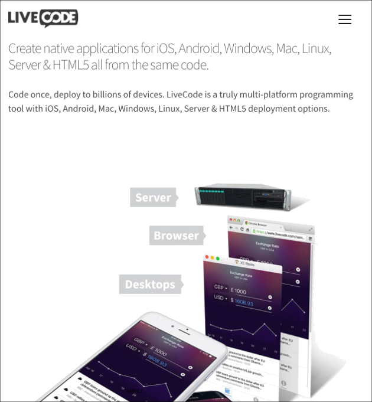

# Browser Widget
The browser widget allows you to display an interact with a web page 
within your app. It wraps browser views on all platforms using native 
browser objects on Mac, iOS and Android, and using the Chromium Embedded Framework (CEF) on Windows and Linux.

## Creating a Browser
A browser widget can be created by dragging it out from the Tools
Palette, where it appears with the following icon:

<svg viewBox="0 0 25 25" style="display:block;margin:auto" width="auto" height="50">
  <path d="M21.7,12c0,5.4-4.4,9.7-9.7,9.7S2.3,17.4,2.3,12S6.6,2.3,12,2.3S21.7,6.6,21.7,12z M11.9,16.6c0-0.2-0.1-0.3-0.3-0.4  C11,16,10.4,16,9.9,15.5c-0.1-0.2-0.1-0.4-0.2-0.6c-0.2-0.2-0.7-0.3-1-0.4c-0.4,0-0.8,0-1.3,0c-0.2,0-0.5,0-0.7,0  c-0.3-0.1-0.5-0.5-0.7-0.8C6,13.6,6,13.4,5.8,13.4c-0.2-0.1-0.4,0.1-0.6,0c-0.1-0.1-0.1-0.2-0.1-0.3c0-0.3,0.2-0.6,0.4-0.8  c0.3-0.2,0.6,0.1,0.9,0.1c0.1,0,0.1,0,0.2,0.1C6.9,12.6,7,13,7,13.3c0,0.1,0,0.2,0,0.2c0,0.1,0.1,0.1,0.2,0.1c0.1-0.5,0.1-1,0.2-1.5  c0-0.6,0.6-1.2,1.1-1.4c0.2-0.1,0.3,0.1,0.5,0c0.6-0.2,2.1-0.8,1.8-1.6C10.6,8.4,10,7.7,9.2,7.8C9,7.9,8.9,8,8.7,8.1  C8.4,8.3,7.8,8.9,7.5,8.9C7,8.8,7,8.1,7.1,7.8c0.1-0.4,1-1.7,1.6-1.5C8.8,6.4,9,6.6,9.1,6.7c0.2,0.1,0.5,0.1,0.8,0.1  c0.1,0,0.2,0,0.3-0.1c0.1-0.1,0.1-0.1,0.1-0.2c0-0.3-0.3-0.6-0.5-0.8C9.6,5.5,9.3,5.3,9,5.2C8,4.9,6.4,5.3,5.6,6  C4.8,6.7,4.2,7.9,3.8,8.9C3.6,9.5,3.4,10.3,3.3,11c-0.1,0.5-0.2,0.9,0.1,1.4C3.7,13,4.3,13.6,4.9,14c0.4,0.3,1.2,0.3,1.6,0.8  c0.3,0.4,0.2,0.9,0.2,1.4c0,0.6,0.4,1.1,0.6,1.6c0.1,0.3,0.2,0.7,0.3,1c0,0.1,0.1,0.7,0.1,0.8c0.6,0.3,1.1,0.6,1.8,0.8  c0.1,0,0.5-0.6,0.5-0.7c0.3-0.3,0.5-0.7,0.8-0.9c0.2-0.1,0.4-0.2,0.6-0.4c0.2-0.2,0.3-0.6,0.4-0.9C11.9,17.3,12,16.9,11.9,16.6z   M12.1,7.4c0.1,0,0.2-0.1,0.4-0.2c0.3-0.2,0.6-0.5,0.9-0.7c0.3-0.2,0.6-0.5,0.8-0.7c0.3-0.2,0.5-0.6,0.6-0.9  c0.1-0.2,0.4-0.6,0.3-0.9c-0.1-0.2-0.6-0.3-0.8-0.4c-0.8-0.2-1.5-0.3-2.3-0.3c-0.3,0-0.7,0.1-0.8,0.4c-0.1,0.5,0.3,0.4,0.7,0.5  c0,0,0.1,0.8,0.1,0.9c0.1,0.5-0.2,0.8-0.2,1.3c0,0.3,0,0.8,0.2,1C12,7.4,12.1,7.4,12.1,7.4z M20.5,14.4c0.1-0.2,0.1-0.5,0.2-0.7  c0.1-0.5,0.1-1,0.1-1.5c0-1-0.1-2-0.4-2.9C20.2,9,20.1,8.7,20,8.4c-0.2-0.5-0.5-1-0.9-1.4c-0.4-0.5-0.9-1.9-1.8-1.5  c-0.3,0.1-0.5,0.5-0.7,0.7c-0.2,0.3-0.4,0.6-0.6,0.9c-0.1,0.1-0.2,0.3-0.1,0.4c0,0.1,0.1,0.1,0.2,0.1c0.2,0.1,0.3,0.1,0.5,0.2  c0.1,0,0.2,0.1,0.1,0.2c0,0,0,0.1-0.1,0.1c-0.5,0.5-1,0.9-1.5,1.4c-0.1,0.1-0.2,0.3-0.2,0.4c0,0.1,0.1,0.1,0.1,0.2  c0,0.1-0.1,0.1-0.2,0.2c-0.2,0.1-0.4,0.2-0.5,0.3c-0.1,0.2,0,0.5-0.1,0.7c-0.1,0.5-0.4,0.9-0.6,1.4c-0.2,0.3-0.3,0.6-0.5,0.9  c0,0.4-0.1,0.7,0.1,1c0.5,0.7,1.4,0.3,2.1,0.6c0.2,0.1,0.4,0.1,0.5,0.3c0.3,0.3,0.3,0.8,0.4,1.1c0.1,0.4,0.2,0.8,0.4,1.2  c0.1,0.5,0.3,1,0.4,1.4c0.9-0.7,1.7-1.5,2.3-2.5C19.9,16,20.2,15.2,20.5,14.4z" />
</svg>

Alternatively it can be created in script using:

	create widget as "com.livecode.widget.browser"

## Displaying Content in a Browser

The most straightforward way to use the browser widget is to set its 
`url` property to display a web page. It can also be set to a local file 
url.

Alternatively the `htmlText` property can be used to render specific 
chunks of html within the browser object. 

## Controlling Navigation
The browser sends the following messages which can be used to control navigation within the browser. See the API documentation for more details:

* browserDocumentLoadBegin
* browserDocumentLoadComplete
* browserDocumentLoadFailed
* browserFrameDocumentLoadBegin
* browserFrameDocumentLoadComplete
* browserFrameDocumentLoadFailed
* browserNavigateBegin
* browserNavigateComplete
* browserNavigateFailed
* browserUnhandledLoadRequest

## Interacting With JavaScript
The browser allows two-way interaction with the javascript running in 
the displayed page. To allow LiveCode handlers to be called from 
JavaScript, there is a `javascriptHandlers` property. This can be set to
a list of LiveCode handlers which appear as methods attached to a global 
`liveCode` object. You can call these methods as you would any other 
JavaScript function and pass whatever parameters you require.

In the other direction, you can use the `do in widget` command to 
execute JavaScript statements in a browser widget. For example:

	-- Use JavaScript to hide "myButton" in the page displayed in a browser widget.
	do "document.getElementById('myButton').hidden = 'hidden'" in widget "myBrowser"