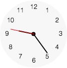
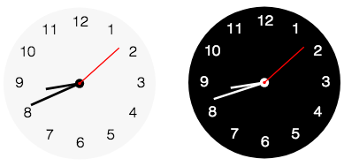

# Clock Widget
The clock widget displays the current time in a given time zone, using
an analog clock face.

## Creating a Clock
A clock widget can be created by dragging it out from the Tools
Palette, where it appears with the following icon:

<svg viewBox="0 0 70 70" style="display:block;margin:auto" width="auto" height="50">
  <path d="M31.7,0C14.2,0,0,14.2,0,31.7s14.2,31.7,31.7,31.7s31.7-14.2,31.7-31.7S49.2,0,31.7,0z M30.2,3.2h2.8v7.3h-2.8V3.2zM10.4,33.1H3.1v-2.8h7.3V33.1z M12.5,52.9l-2-2l5.2-5.2l2,2L12.5,52.9z M15.7,17.7l-5.2-5.2l2-2l5.2,5.2L15.7,17.7z M33.1,60.2h-2.8v-7.3h2.8V60.2z M42.3,45.4L31.8,34.9c0,0-0.1,0-0.1,0c-1.7,0-3-1.3-3-3c0-1.1,0.6-2.1,1.6-2.6V12.9h2.8v16.3c0.9,0.5,1.6,1.5,1.6,2.6c0,0.2,0,0.4-0.1,0.5L45,42.8L42.3,45.4z M50.8,52.9l-5.2-5.2l2-2l5.2,5.2L50.8,52.9z M47.7,17.7l-2-2l5.2-5.2l2,2L47.7,17.7z M52.9,33.1v-2.8h7.3v2.8H52.9z" />
</svg>

Alternatively it can be created in script using:

	create widget as "com.livecode.widget.clock"

## Clock Display

The clock has two different styles, depending on whether it is day or
night. By default the hands are dark on a light background when displaying
a time at night (between 8PM and 6AM), and the hands are light on a dark
background when displaying a time during the day.

These colors can be customised using the `dayNumberColor`, `dayHourHandColor`, `dayMinuteHandColor`, `daySecondHandColor` and `dayFaceColor` properties,
and the equivalent properties for night.

The read-only property `isDay` also reflects whether the current time is
AM or PM.

The time displayed by the clock can differ from the current system local time by setting the timeZone property, an integer which adjusts the time displayed relative to universal time (UTC). For instance, to set the clock to display
a time that is 6 hours ahead of UCT time ("+06:00"):

`set the timeZone of widget "Clock" to 21600`

as 21600 seconds is 6 hours.
