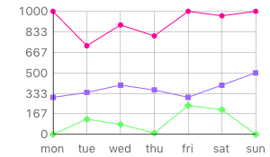
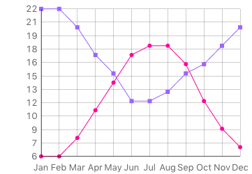
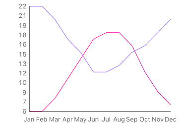
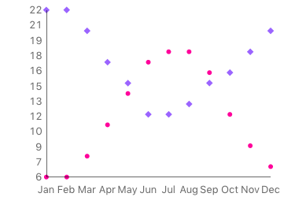
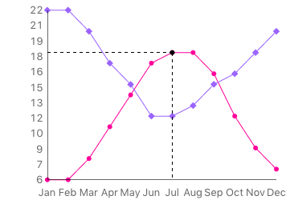

# Line Graph Widget
The line graph widget provides the ability to display data quickly and 
easily. When the Line Graph is first dragged out from the tools palette 
onto your stack, you will see it is pre-initialised with a few series of 
data so you already have something that looks like a chart.

## Creating a Line Graph
A line graph widget can be created by dragging it out from the Tools
Palette, where it appears with the following icon:

<svg viewBox="0 0 50 40" style="display:block;margin:auto" width="auto" height="50">
  <path d="M496 1408Q496 1468 453.5 1510 411 1552 352 1552 292 1552 250 1510 208 1468 208 1408 208 1348 250 1306 292 1264 352 1264 411 1264 453.5 1306 496 1348 496 1408ZM928 1600Q928 1653 890.5 1690.5 853 1728 800 1728 747 1728 709.5 1690.5 672 1653 672 1600 672 1547 709.5 1509.5 747 1472 800 1472 853 1472 890.5 1509.5 928 1547 928 1600ZM320 960Q320 1026 273 1073 226 1120 160 1120 94 1120 47 1073 0 1026 0 960 0 894 47 847 94 800 160 800 226 800 273 847 320 894 320 960ZM1360 1408Q1360 1454 1327 1487 1294 1520 1248 1520 1202 1520 1169 1487 1136 1454 1136 1408 1136 1362 1169 1329 1202 1296 1248 1296 1294 1296 1327 1329 1360 1362 1360 1408ZM528 512Q528 585 476.5 636.5 425 688 352 688 279 688 227.5 636.5 176 585 176 512 176 439 227.5 387.5 279 336 352 336 425 336 476.5 387.5 528 439 528 512ZM992 320Q992 400 936 456 880 512 800 512 720 512 664 456 608 400 608 320 608 240 664 184 720 128 800 128 880 128 936 184 992 240 992 320ZM1536 960Q1536 1000 1508 1028 1480 1056 1440 1056 1400 1056 1372 1028 1344 1000 1344 960 1344 920 1372 892 1400 864 1440 864 1480 864 1508 892 1536 920 1536 960ZM1328 512Q1328 545 1304.5 568.5 1281 592 1248 592 1215 592 1191.5 568.5 1168 545 1168 512 1168 479 1191.5 455.5 1215 432 1248 432 1281 432 1304.5 455.5 1328 479 1328 512Z" />
</svg>

Alternatively it can be created in script using:

	create widget as "com.livecode.widget.linegraph"

## Properties
Unarguably the most important property you will need to know about as 
you start using the line graph is the `graphData`. The `graphData` is 
comma and line delimited with the first item of each line being a point 
on the x-axis and each subsequent item on a line being a point on the 
y-axis of a data series.

For example:

	local tData
	put "Jan,6,22" & return & \
		"Feb,6,22" & return & \
		"Mar,8,20" & return & \
		"Apr,11,17" & return & \
		"May,14,15" & return & \
		"Jun,17,12" & return & \
		"Jul,11,18" & return & \
		"Aug,18,13" & return & \
		"Sep,16,15" & return & \
		"Oct,12,16" & return & \
		"Nov,9,18" & return & \
		"Dec,7,20" into tData
		
	set the graphData of widget "Line Graph" to tData

The `graphXLines` and `graphYLines` properties control whether the graph
displays the horizontal and vertical lines respectively. The 
`markerStyles` property controls the shapes of the data markers. This
can be set to `empty` to remove the markers entirely. For example, to 
remove all extraneous parts of the graph other than the data line, use
the following:

	set the graphXLines of widget "Line Graph" to false
	set the graphYLines of widget "Line Graph" to false
	set the markerStyles of widget "Line Graph" to empty
	

	
A marker style may be `empty`, `"circle"`, `"diamond"`, `"square"`, 
`"filled circle"`, `"filled diamond"` or `"filled square"`. 
The `showLines` property governs the line visibility so that you can 
just show markers:

	local tMarkers
	put "filled circle" & return & "filled diamond" into tMarkers
	set the markerStyles of widget "Line Graph" to tMarkers
	set the showLines of widget "Line Graph" to false

We can set the line/marker colors with the `graphColors` property. This 
is a return-delimited list of colors in RGB(A) format. For example:

	local tLineColors
	put "255,0,0,128" & return & "0,255,0,128" into tLineColors
	set the graphColors of widget "Line Graph" to tLineColors

The final property of the Line Graph is the `hilitedCoordinates` 
property. You can set the `hilitedCoordinates` to a point on any of the 
lines on the chart. For example:

	local tHilitedDataPoint
	put "Jul,18" into tHilitedDataPoint
	set the hilitedCoordinates of widget "Line Graph" to tHilitedDataPoint

