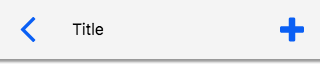
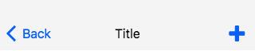
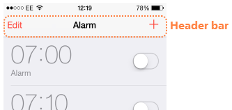
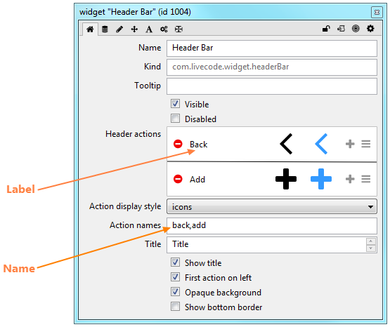
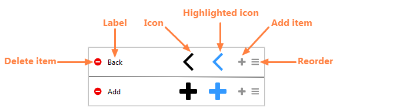
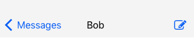
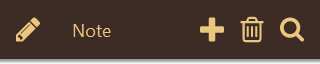
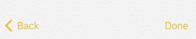
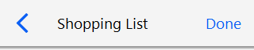
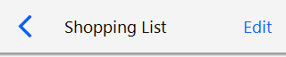

# Header Bar Widget
The header bar widget can be used to allow the user to navigate around 
your app and take actions, providing a visual structure to your app.
The widget emulates the iOS navigation bar and the Android app bar. If 
you are working on Mac a header bar widget will be themed like an iOS 
navigation bar, if you are working on Windows or Linux it will be themed 
like an Android app bar.

Windows / Linux / Android

Mac / iOS

For example in the iOS Clock app the header bar allows the user to 
choose to edit or add an alarm by navigating to another screen within 
the Alarm section of the app.

As well as navigating around the app the header bar can also be used to provide access to options such as search, save and delete.

## Creating a Header Bar
A header bar widget can be created by dragging it out from the Tools
Palette, where it appears with the following icon:

<svg viewBox="0 0 80 30" style="display:block;margin:auto" width="auto" height="50">
  <path d="M0,0v29.5h80.2V0H0z M13.2,20.6l-1.8,1.8l-7.5-7.5l0.1-0.1l-0.1-0.1l7.5-7.5l1.8,1.8l-5.8,5.8L13.2,20.6z M31.2,10.9h-3.8v10.3h-2.6V10.9H21V8.7h10.2V10.9z M34.7,21.2h-2.5v-9.3h2.5V21.2z M34.7,10.8h-2.5V8.6h2.5V10.8z M41.3,13.7h-1.5v4.9c0,0.4,0,0.6,0.1,0.7c0.1,0.1,0.4,0.1,0.9,0.1c0.1,0,0.2,0,0.2,0s0.2,0,0.2,0v1.8l-1.1,0c-1.1,0-1.9-0.2-2.3-0.6c-0.3-0.3-0.4-0.7-0.4-1.3v-5.7h-1.3V12h1.3V9.4h2.4V12h1.5V13.7z M45.4,21.2h-2.4V8.7h2.4V21.2z M56.2,17.3h-6.8c0,0.9,0.4,1.6,1,2c0.4,0.2,0.8,0.3,1.3,0.3c0.6,0,1-0.1,1.3-0.4c0.2-0.2,0.4-0.4,0.5-0.6h2.5c-0.1,0.6-0.4,1.1-0.9,1.7c-0.8,0.9-2,1.4-3.5,1.4c-1.2,0-2.3-0.4-3.3-1.1c-0.9-0.8-1.4-2-1.4-3.7c0-1.6,0.4-2.8,1.3-3.7c0.9-0.9,2-1.3,3.3-1.3c0.8,0,1.5,0.1,2.2,0.4c0.6,0.3,1.2,0.7,1.6,1.4c0.4,0.6,0.6,1.2,0.7,1.9c0,0,0,0.1,0,0.1h-2.5c-0.1-0.6-0.3-1-0.6-1.4c-0.4-0.3-0.9-0.5-1.4-0.5c-0.6,0-1.1,0.2-1.4,0.5c-0.3,0.4-0.6,0.8-0.6,1.4h3.1h1.1h2.5C56.2,16.1,56.2,16.6,56.2,17.3z M76.1,16.2h-4.6v4.6h-3v-4.6h-4.6v-3h4.6V8.7h3v4.6h4.6V16.2z" />
</svg>

Alternatively it can be created in script using:

	create widget as "com.livecode.widget.headerbar"

## Using the Header Bar

The header bar gets a `mouseUp` message when it is clicked on, you 
handle this message to take the appropriate action for the chosen 
action.

The default `mouseUp` handler of the header bar is

	on mouseUp
	   local tActionName
	   put the mouseAction of me into tActionName

	   if tActionName is not empty then
		  -- Execute script triggered by the given action
	   end if
	end mouseUp
	
Firstly we get the value of the `mouseAction` property, which gives us 
the name of the header action that was just clicked, allowing us to do 
something different depending of what action was clicked. For example

	on mouseUp
	   local tActionName
	   put the mouseAction of me into tActionName

	   if tActionName is "back" then
		  go to card "messageList"
	   else if tAction is "add" then
		  go to card "newMessage"
	   end if
	end mouseUp
	
> **Note:** it is import to remember that the `mouseAction` property 
> gives you the action name, not the label. Both can be set in the 
> Property Inspector.

The label is the text that is displayed for an action, when the Action 
display style is set to “text”. The name is the name of the action, as 
returned by the `mouseAction` property.

## Customising the Header Bar

The actions displayed in the header bar, and the appearance of the header bar itself, can be controlled using the Property Inspector.

The header bar can: 

* Show a title
* Have the first action on the left
* Have an opaque background
* Have a bottom border
* Use icons or text for displaying actions

The Property Inspector also allows you to set up all the actions that 
are shown on the header bar, setting the label, icon and highlight icon 
for each action and allowing you to reorder, add and delete actions.

When one of the icons is clicked, a scrollable icon picker is popped up 
to allow you to choose a new icon. The current selection is highlighted 
as shown.

The icon and highlighted icon can be different, to allow further visual 
feedback about what is currently selected.

The colors of the navigation bar are controlled by the 
`foregroundColor`, `backgroundColor`, `borderColor`, and `hiliteColor` 
properties as usual for LiveCode controls. Changing these properties 
allows you to customise the header bar to fit in with the design of your 
app.

## Examples

Messages Header

Notes Header

## Scripting
Beyond handling the `mouseUp` message and using the `mouseAction` 
property to act on the selected action the other thing you might want to 
do with your header is to update it depending on the state of the app. 
For example if you choose to edit an item in a list the header options 
might change to “cancel” and “save”, or similar. You can change the 
header actions in script by setting the `itemLabels`, `itemNames`, 
`itemIcons` or `hilitedItemIcons` properties of the header bar widget. 
The values of these properties are comma-delimited lists and can be 
updated using chunk expressions.

This example shows how to switch a header bar action between “edit” and 
“done”

	on mouseUp
		local tActionName, tActionNames, tActionLabels
		put the mouseAction of me into tActionName 
		put the itemNames of me into tActionNames 
		put the itemLabels of me into tActionLabels 

		if tActionName is "edit" then 
			put "done" into item 2 of tActionNames 
			put "Done" into item 2 of tActionLabels 
			set the itemNames of me to tActionNames 
			set the itemLabels of me to tActionLabels 
		else if tActionName is "done" then 
			put "edit" into item 2 of tActionNames 
			put "Edit" into item 2 of tActionLabels 
			set the itemNames of me to tActionNames 
			set the itemLabels of me to tActionLabels 
		end if 
	end mouseUp
	
## Switching Theme
Setting the `theme` of the header bar to "Android" or "iOS" will 
temporarily display it using the metrics of the chosen platform. This
property is transient - it is not saved with the stack as it uses the 
appropriate mobile theme for the platform is is running on.