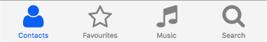
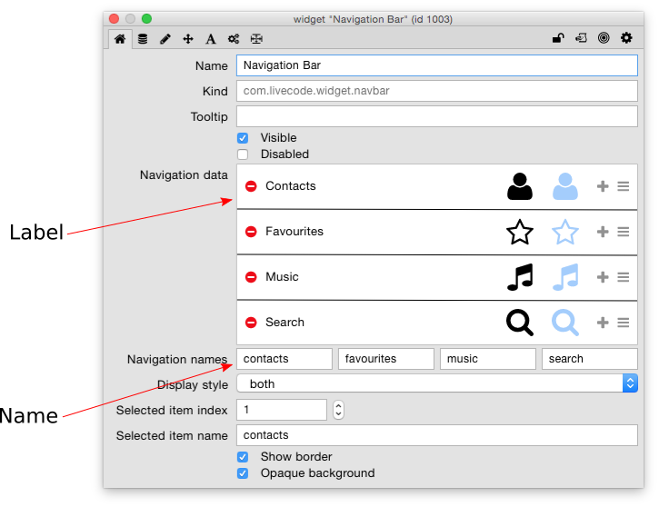
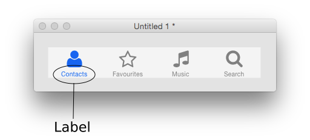
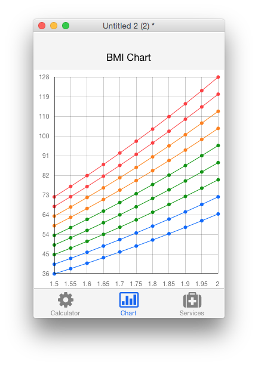
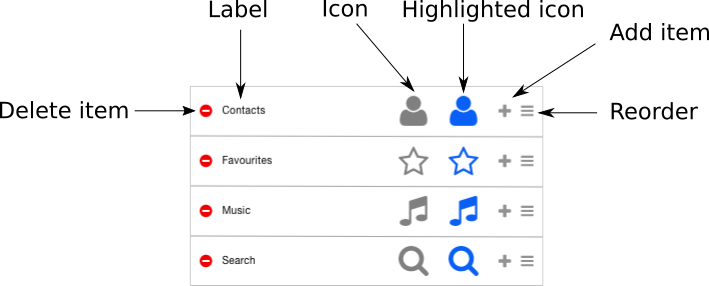
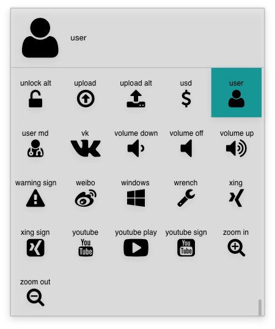
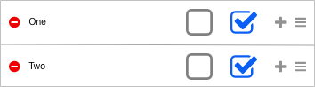
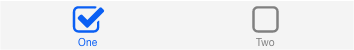
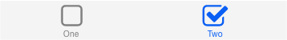

# Navigation Bar Widget

The most common way to use the navigation bar is as a way of allowing 
the user to switch between the screens of your app. It emulates the 
native navigation bars on iOS and Android.

## Creating a Navigation Bar
A navigation bar widget can be created by dragging it out from the Tools
Palette, where it appears with the following icon:

<svg viewBox="0 0 80 30" style="display:block;margin:auto" width="auto" height="50">
  <path d="M0,0v29.5h80.2V0H0z M21.1,21.5c-0.2-0.1-0.4-0.2-0.4-0.2c-0.5-0.2-0.9-0.3-1.4-0.4c-0.7-0.1-0.9-0.4-0.9-1.1c0-0.1-0.1-0.9,0-1c0.4-0.2,0.5-0.9,0.5-1.3c0-0.3,0.2-0.5,0.3-0.7c0.2-0.3,0.2-0.6,0.3-0.9c0.1-0.2,0.2-0.6,0.1-0.8c0-0.2-0.2-0.4-0.2-0.6c0-0.3,0.1-0.6,0.1-0.9c0-0.5,0-0.9,0-1.4c-0.2-1.2-1.4-1.6-2.5-1.9c-1-0.2-2.2,0.3-2.9,1c-0.3,0.3-0.6,0.7-0.7,1.1c-0.1,0.4,0,0.9,0,1.2c0,0.2,0,0.4,0.1,0.6c0,0.2,0.1,0.3,0.1,0.5c0,0.1-0.1,0.2-0.1,0.3c-0.2,0.4,0,1,0.2,1.4c0.1,0.2,0.2,0.4,0.3,0.5c0.2,0.2,0.2,0.3,0.2,0.6c0,0.4,0.1,1.2,0.6,1.4c0.1,0.1,0,0.8-0.1,0.9c0,0.7,0,1-0.6,1.1c-0.5,0.1-0.9,0.2-1.4,0.4c-0.2,0.1-0.4,0.2-0.7,0.3c-2-1.4-3.4-3.8-3.4-6.4c0-4.3,3.5-7.8,7.8-7.8s7.8,3.5,7.8,7.8C24.3,17.8,23,20.1,21.1,21.5z M45.1,22.7l-4.9-3.6v-0.7l0.2,0.2l3.6,2.6L42.6,17l-0.1-0.4l0.3-0.3l3.4-2.5H42h-0.4l-0.1-0.4l-1.4-4.2l-1.4,4.2l-0.1,0.4h-0.4h-4.3l3.4,2.5l0.3,0.3L37.5,17l-1.4,4.2l3.6-2.6l0.2-0.2v0.7L35,22.7l1.9-5.9l-4.9-3.6h6.1l1.9-5.9l1.9,5.9h6.1l-4.9,3.6L45.1,22.7z M71.1,23.1l-4.9-4.9c-1,0.9-2.4,1.4-3.9,1.5V19c3-0.1,5.4-2.5,5.4-5.5c0-3.1-2.5-5.5-5.5-5.5c-3.1,0-5.5,2.5-5.5,5.5c0,3,2.4,5.4,5.4,5.5v0.7c-3.4-0.1-6-2.8-6-6.2c0-3.4,2.8-6.2,6.2-6.2c3.4,0,6.2,2.8,6.2,6.2c0,1.5-0.6,2.9-1.5,4l4.9,4.9L71.1,23.1z" />
</svg>

Alternatively it can be created in script using:

	create widget as "com.livecode.widget.navbar"

## Using the Navigation Bar
When used to navigate through an app by switching cards, the navigation 
bar will typically contain just a few lines of code:

	on hiliteChanged
		go to card the hilitedItemName of me
	end hiliteChanged
	
>**Note:** it is important to understand the distinction between the 
> name and the label of each navigation item. If you open up the 
> property inspector for the navigation bar, you can change both of 
> them.

The text that is actually displayed for a navigation item, provided the 
display style is either “text” or “both”, is the label.

The value of the `hilitedItemName` property is the name of the currently 
highlighted navigation item. This allows multiple items to have the same 
label and still be distinguishable from script.

When using the navigation bar in this way, the simplest thing to do is 
to put the widget into a group and set the group to behave like a 
background. This will ensure the navigation bar is automatically placed 
on new cards of the stack. This is how the navigation bar is used (in 
conjunction with the header bar widget) in the interactive tutorial app.

## Customising a Navigation Bar
Individual properties of each navigation item, and the order they are displayed, can be changed using the property inspector.

When one of the icons is clicked, a scrollable icon picker is popped up 
to allow you to choose a new icon. The current selection is highlighted 
as shown.

The icon and highlighted icon can be different, to allow further visual 
feedback about what is currently selected. One way of using this is to 
turn the navigation bar as a single-selection option control, as might 
be used in a multiple choice quiz app.

The colors of the navigation bar are controlled by the `foreColor`, 
`backColor`, `borderColor`, and `hiliteColor` properties as usual for 
LiveCode controls.

## Scripting
Aside from responding to a change in the highlight using the 
`hiliteChanged` message, there is generally not very much that requires 
scripting when using the navigation bar. However, each of the various 
aspects of the navigation bar items’ display (icon, highlighted icon, 
label) can be set individually from script using the `itemLabels`, 
`itemIcons` and `hilitedItemIcons` properties. The values of these 
properties are just comma-delimited lists. It can be handy to write 
utility functions to set these if you are going to do so often, for 
example:

	command setLabelAtIndex pLabel, pIndex
	  local tLabels
	  put the itemLabels of widget "navbar" into tLabels
	  put pLabel into item pIndex of tLabels
	  set the itemLabels of widget "navbar" to tLabels
	end setLabelAtIndex

Alternatively, it is possible to set all the data of the navbar at once, 
using the itemArray property.

	local tNavItems
	put "Contacts" into tNavItems[1]["label"]
	put "contacts" into tNavItems[1]["name"]
	put "user" into tNavItems[1]["icon_name"]
	put "user" into tNavItems[1]["hilited_icon_name"]
	...
	set the itemArray of widget "navbar" to tNavItems
