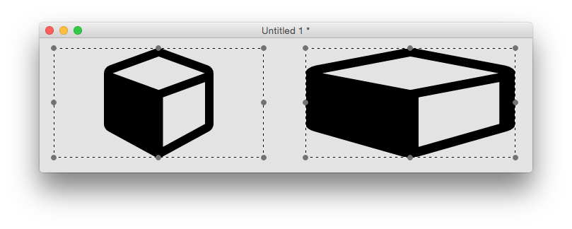
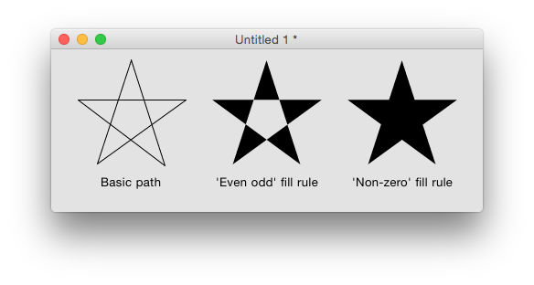

# SVG Path Widget
The SVG path widget can be used to display simple SVG paths. It has a 
number of properties which control how the path is displayed.

## Creating an SVG Path
An SVG path widget can be created by dragging it out from the Tools
Palette, where it appears with the following icon:

<svg viewBox="0 0 65 40" style="display:block;margin:auto" width="auto" height="50">
  <path d="M61.8,0H4C1.8,0,0,1.8,0,4v27.8c0,2.2,1.8,4,4,4h57.8c2.2,0,4-1.8,4-4V4C65.8,1.8,64,0,61.8,0z M20.9,25.3c-1.2,0.9-2.8,1.4-4.9,1.4c-0.8,0-1.6-0.1-2.2-0.2c-0.7-0.1-1.3-0.3-1.9-0.5c-0.1,0.2-0.3,0.4-0.5,0.5s-0.5,0.2-0.8,0.2c-0.6,0-1-0.1-1.2-0.3c-0.2-0.2-0.4-0.6-0.4-1.2l-0.1-3.2v-0.2c0-0.6,0.1-1,0.3-1.3c0.2-0.2,0.6-0.4,1.2-0.4c0.6,0,1.1,0.4,1.5,1.3c0.1,0.2,0.2,0.4,0.2,0.5c0.4,0.7,0.9,1.2,1.5,1.6c0.6,0.4,1.4,0.5,2.4,0.5c0.8,0,1.5-0.2,2-0.5c0.5-0.4,0.7-0.8,0.7-1.5c0-1-1.1-1.7-3.2-2.2c-0.6-0.1-1.1-0.3-1.5-0.4c-1.8-0.5-3-1.1-3.7-1.8c-0.7-0.7-1-1.7-1-2.9c0-1.6,0.6-2.9,1.8-3.9c1.2-1,2.7-1.5,4.6-1.5c0.6,0,1.2,0.1,1.8,0.2c0.6,0.1,1.2,0.3,1.8,0.6c0.1-0.3,0.3-0.5,0.5-0.6c0.2-0.1,0.4-0.2,0.8-0.2c0.5,0,0.9,0.1,1,0.3c0.2,0.2,0.2,0.6,0.3,1.2l0.1,2.7v0.2c0,0.5-0.1,0.9-0.3,1.1c-0.2,0.2-0.6,0.3-1.1,0.3c-0.7,0-1.1-0.4-1.5-1.1c0-0.1-0.1-0.2-0.1-0.2c-0.3-0.6-0.7-1-1.2-1.3c-0.5-0.3-1.1-0.4-1.7-0.4c-0.8,0-1.5,0.2-2,0.6s-0.8,0.9-0.8,1.5c0,0.8,1.2,1.5,3.5,2c0.4,0.1,0.7,0.1,0.9,0.2c1.8,0.4,3.1,1,3.8,1.8c0.8,0.8,1.2,1.9,1.2,3.2C22.6,23.1,22,24.4,20.9,25.3zM40.9,12.5c-0.3,0.3-0.6,0.4-1.1,0.4h-0.2l-4.2,12c-0.2,0.6-0.4,1-0.6,1.1s-0.6,0.2-1.1,0.2h-1.7c-0.8,0-1.4-0.4-1.7-1.3l0-0.1l-4.3-12h-0.2c-0.5,0-0.8-0.1-1.1-0.4s-0.4-0.6-0.4-1.1c0-0.6,0.1-0.9,0.4-1.2s0.7-0.4,1.3-0.4H30c0.6,0,1,0.1,1.3,0.4c0.3,0.2,0.4,0.6,0.4,1.2c0,0.5-0.1,0.9-0.4,1.2c-0.3,0.2-0.7,0.4-1.3,0.4h-0.4l3.3,9.8l3.4-9.8H36c-0.6,0-1-0.1-1.3-0.4c-0.3-0.2-0.4-0.6-0.4-1.2c0-0.5,0.1-0.9,0.4-1.2c0.3-0.2,0.7-0.4,1.3-0.4h3.5c0.6,0,1.1,0.1,1.3,0.4c0.3,0.2,0.4,0.6,0.4,1.2C41.3,11.9,41.2,12.2,40.9,12.5z M57.8,20.6c-0.3,0.3-0.6,0.4-1.1,0.4h-0.2v3.3v0.2c0,0.3,0,0.5-0.1,0.6s-0.2,0.2-0.4,0.4c-0.5,0.3-1.4,0.6-2.5,0.8c-1.1,0.2-2.3,0.4-3.5,0.4c-2.4,0-4.4-0.8-5.9-2.4c-1.5-1.6-2.2-3.7-2.2-6.2c0-2.5,0.8-4.5,2.3-6.2c1.5-1.6,3.4-2.5,5.8-2.5c0.6,0,1.3,0.1,1.9,0.2s1.3,0.4,2,0.7c0.2-0.3,0.4-0.6,0.6-0.7c0.2-0.1,0.4-0.2,0.7-0.2c0.5,0,0.8,0.1,1,0.4c0.2,0.2,0.3,0.6,0.3,1.2l0,3.6c0,0.6-0.1,1.1-0.3,1.3c-0.2,0.2-0.6,0.3-1.1,0.3c-0.4,0-0.7-0.1-0.9-0.3c-0.2-0.2-0.4-0.5-0.5-1C53.3,14,53,13.4,52.5,13s-1.2-0.6-2.2-0.6c-1.4,0-2.5,0.5-3.3,1.4c-0.8,1-1.1,2.3-1.1,4.2s0.4,3.2,1.2,4.2c0.8,1,1.9,1.5,3.4,1.5c0.3,0,0.7,0,1.1-0.1c0.4-0.1,0.9-0.2,1.5-0.4V21h-1.6c-0.6,0-1.1-0.1-1.3-0.3c-0.3-0.2-0.4-0.6-0.4-1.1c0-0.6,0.1-0.9,0.4-1.2s0.7-0.4,1.3-0.4h5c0.6,0,1.1,0.1,1.4,0.3s0.4,0.6,0.4,1.2C58.2,20,58.1,20.4,57.8,20.6z" />
</svg>

Alternatively it can be created in script using:

	create widget as "com.livecode.widget.svgpath"

## Paths
The SVG path displayed by the widget is either one of the named ‘preset’ 
paths, or any basic SVG path. Setting either the `iconPresetName` 
property or the `iconPath` property will override any setting of the 
other property. The `iconPresetName` is one of the preset icons which 
can be listed using the `iconNames()` function, or selected via the 
property inspector. Clicking the currently set icon in the property 
inspector will bring up the icon picker, allowing you to pick one of the 
preset icons. Setting one of the preset icons will cause its iconPath 
property to be set to the path of the current icon. If there is no 
preset path that fulfils your requirements then you’ll have to set the 
`iconPath` property to the SVG path of the image you want. Some 
information on extracting valid SVG paths from images are discussed at 
the end of this post.

## Highlighting
The `hilite` property can be used to alter the appearance of the svg 
path widget to indicate it has been clicked, for example. The fill color 
of a highlighted svg path widget is determined by its `hiliteColor`.
Although this effect can also be achieved by changing the `foreColor` 
property, the advantage of setting the `hilite` property is that the 
`hiliteColor`, if empty, will be inherited. Thus you can ensure 
consistency of highlight colors by setting the `hiliteColor` of the 
group or stack containing the widget.

## Rotation and Reflection
The `angle` property can be used to rotate an svg path. This can be 
handy if you need to tweak one of the preset paths, for example to make 
a finger point at something from a slightly different direction:

The `flipped` property can be used similarly. For example, here it is 
used in conjunction with the `angle` property to make a fire 
extinguisher icon face the other way.

## Aspect Ratio
The `maintainAspectRatio` property determines whether the path is 
stretched to fit the object bounds or not. For example, the cube icon 
will always be a cube if `maintatinAspectRatio` is true, but can be 
stretched to a cuboid if not.

## Fill Rule
SVG paths can cross over themselves, which causes an ambiguity when 
determining what exactly constitutes the interior of the path (for 
filling purposes). The `fillRule` property controls how the engine 
chooses what to fill. Take for example a five-pointed star, defined in a 
simple way using a moveTo command and five lineTo commands, e.g.

	M4,47h117l-95,69 36-111 36,111z

The two available fill rules work by determining how many path segments 
are crossed by a straight line going infinitely in one direction from a 
given enclosed region. Using the above example, starting anywhere inside 
the central pentagon of the star, such a line would always cross 2 path 
segments. The ‘even odd’ fill rule states that a region should be filled 
if this number is even, and not filled if it is odd. The ‘non-zero’ fill 
rule states that a region should be filled if this number is non-zero.

So for the five-pointed star example above, we have the following 
results:

## Width and Height
All LiveCode objects have width and height properties, and the SVG path 
widget is no different. However, these do not necessarily reflect the 
actual bounds of what is drawn – for example if the 
`maintainAspectRatio` property is set to true, as can be seen in the 
cube / cuboid example above, there may be a significant difference. 
The SVG path widget has read-only `scaledWidth` and `scaledHeight` 
properties which return the width and height of the path as it is 
currently being rendered.

## How to Get SVG Paths
Many image manipulation programs allow images to be exported as SVG, and 
there are many SVG files available online, for example at Open Clipart, 
however these cannot always be converted into simple SVG paths.

If an SVG file consists of a simple polyline element, you can often 
convert it to the correct form by putting M (moveTo command) before the 
first co-ordinate, L (lineTo command) before the second co-ordinate, and 
adding Z (closePath command) at the end. This works for example when 
creating a polyline svg using an online drawing website such as Vector 
Paint.

See the following forum post for more information on extracting simple 
paths from SVG files: http://forums.livecode.com/viewtopic.php?f=8&t=27202