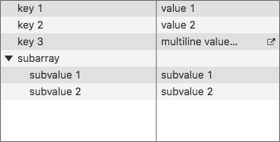
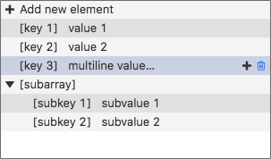
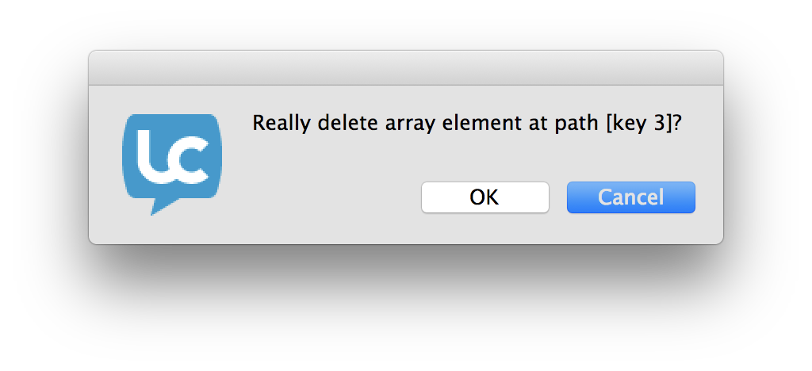
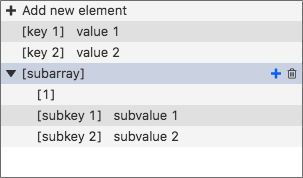
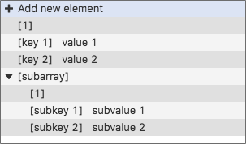
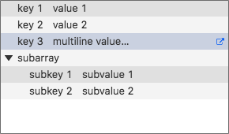

# Tree View
The tree view widget provides a way to represent a LiveCode array 
visually in various ways. In its simplest form, it allows selection of
key/value pairs, and folding and unfolding of nested arrays.

## Creating a Tree View
A tree view widget can be created by dragging it out from the Tools
Palette, where it appears with the following icon:

<svg viewBox="0 170 220 110" style="display:block;margin:auto" width="auto" height="50">
  <path d="M152.4,249.7c-6.4,0-11.8,4.3-13.5,10.1h-10v-26.7h10c1.7,5.8,7.1,10.1,13.5,10.1c7.8,0,14.1-6.3,14.1-14.1s-6.3-14.1-14.1-14.1c-6.4,0-11.8,4.3-13.5,10.1h-10v-16.1c8.4-1.8,14.8-9.3,14.8-18.3c0-10.4-8.4-18.8-18.8-18.8s-18.8,8.4-18.8,18.8c0,9,6.3,16.5,14.7,18.3v58.8h18c1.7,5.8,7.1,10.1,13.5,10.1c7.8,0,14.1-6.3,14.1-14.1S160.2,249.7,152.4,249.7z M128.7,202h-7.5v-7.5h-7.5V187h7.5v-7.5h7.5v7.5h7.5v7.5h-7.5V202z" />
</svg>

Alternatively it can be created in script using:

	create widget as "com.livecode.widget.treeview"

## Using the Tree View
The content of the tree view is controlled by using the `arrayData` 
property. The following handlers can be used to set and get data on a 
specific `pathDelimiter`-delimited path rather than the whole array:

	command setArrayDataOnPath pValue, pPath, @xArray
	   local tKey
	   set the itemdelimiter to the pathDelimiter of widget 1 of me
	   put item 1 of pPath into tKey
	   if the number of items in pPath is 1 then
		  put pValue into xArray[tKey]
	   else
		  delete item 1 of pPath
		  setArrayDataOnPath pValue, pPath, xArray[tKey]
	   end if
	end setArrayDataOnPath

	command fetchArrayDataOnPath pPath, pArray, @rData
	   local tKey
	   set the itemdelimiter to the pathDelimiter of widget 1 of me
	   put item 1 of pPath into tKey
	   if the number of items in pPath is 1 then
		  if tKey is not among the keys of pArray then
			 return "no such key"
		  else
			 put pArray[tKey] into rData
			 return empty
		  end if
	   else
		  delete item 1 of pPath
		  fetchArrayDataOnPath pPath, pArray[tKey], rData
	   end if
	end fetchArrayDataOnPath

## Display Properties
The tree view widget has a number of display options:

* `alternateRowBackgrounds` - Whether the alternate rows of the widget have different backgrounds or not.
* `hilitedElement` - The selected row, given by a `pathDelimiter`-delimited path.
* `readOnly` - Whether the options to modify elements of the underlying array are present or not. See the [Edit Mode](#edit-mode) section for more information on what is not visible in read-only mode.
* `separatorRatio` - Manipulates the size of the view columns.
* `showBorder` - Whether the widget has a border or not.
* `showSeparator` - Whether the separator bar between keys and values is showing or not.
* `sortOrder` - Manipulates the order in which elements of the tree view are displayed, with respect to the current `sortType`.
* `sortType` - Manipulates the type of ordering in which elements of the tree view are displayed.
* `arrayStyle` - Whether the tree view should display its contents in array style or as a standard tree view.

## Edit Mode
When in edit mode, there are a number of additional user-interactions 
available. The following two show at the end of a given line when the 
mouse hovers over it:

* Delete keys

When the delete icon is clicked, the user is asked for confirmation to
delete the key in question.

* Add new sub-keys

Clicking the plus icon adds a new numerically named key underneath the 
nested array that was clicked. When the row contains a text value, that
value is discarded and a new nested array created at the chosen key.

The final one is always visible as the top row:

* Add new top-level keys

Clicking the 'Add new element' row that is displayed in edit mode adds
a new default top-level key to the array. It has a numeric key.

>**Note:** As LCB does not yet allow text input, there is no way to 
> allow a user to edit the keys and values inline. In order to provide 
> such functionality, you would have to create fields and track the 
> current `hilitedElement`.

## Messages
The widget sends a number of messages in response to actions. When the 
underlying data changes, a `dataChanged` message is sent. This is handy 
when the widget is not `readOnly` and therefore the content can be 
changed by user interaction. 

The `hiliteChanged` message is sent when the user clicks on a row to 
select or deselect it.

When a row is double-clicked, an `actionDoubleClick` message is sent. 
The `actionInspect` message is sent when the inspect icon is clicked - 
this icon is displayed when the tree view value is too long to be 
displayed, or contains multiple lines.

